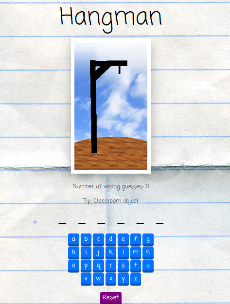

<h1 align="center">Hangman Game</h1>
<h4 align="center">
   
</h4>

  <a href="#rocket-built-with">Built With</a>&nbsp;&nbsp;&nbsp;|&nbsp;&nbsp;&nbsp;
  <a href="#-about">About</a>&nbsp;&nbsp;&nbsp;|&nbsp;&nbsp;&nbsp;
  <a href="#-how-to-contribute">How to Contribute</a>&nbsp;&nbsp;&nbsp;|&nbsp;&nbsp;&nbsp;
  <a href="#author">Author</a>

## :rocket: Built With

- [React](https://reactjs.org)

## 💻 About

The hangman game is a game where the players has to guess a word. It a simple game with the goal of learning react.

## 🤔 How to Contribute

- Clone this repository: `git clone https://github.com/Lukazovic/hangman-react-app.git`;
- Create your branch with your feature: `git checkout -b my-feature`;
- Commit your feature: `git commit -m 'feat: My new feature'`;
- Push to your branch: `git push origin my-feature`.

Then merge your pull request, you can now delete your branch

> **Tip:** A simple and easy way to starting contributing with this project is by adding some words to the game. The file is at `./src/words.js`

## Author

<table>
  <tr>
    <td align="center"><a href="https://github.com/Lukazovic"> <b>Lucas Vieira</b></a> <a href="https://github.com/Lukazovic/be-the-hero" title="Code">💻</a></td>
  <tr>
</table>
